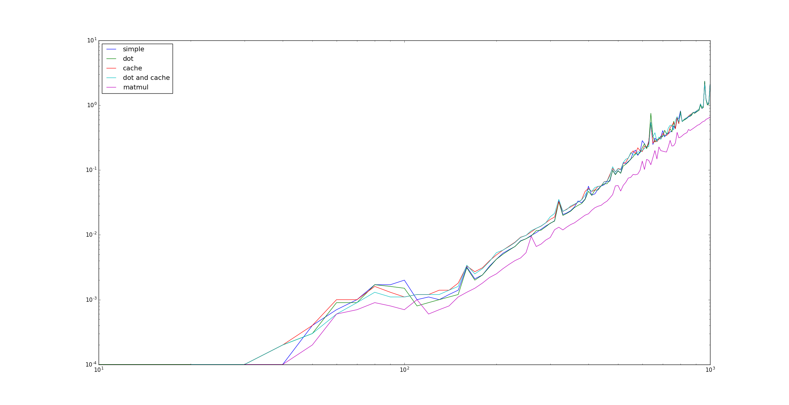

# Fortran2
Project was written using ifort compilator.

## Tests
To run tests
```
make test
./test
```
## Results
To generate results.txt file
```
make build
./main
```
Graph internpretation of result


